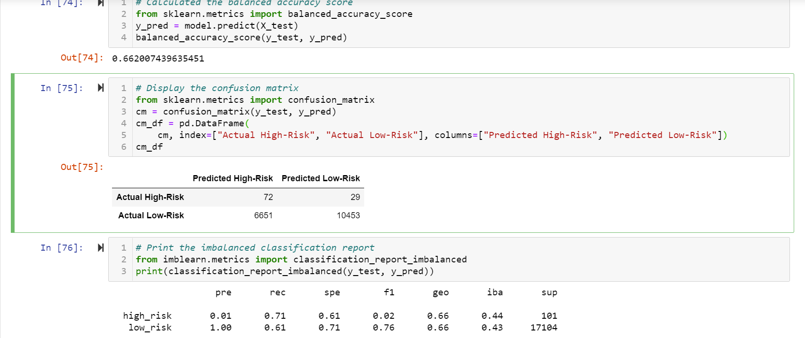
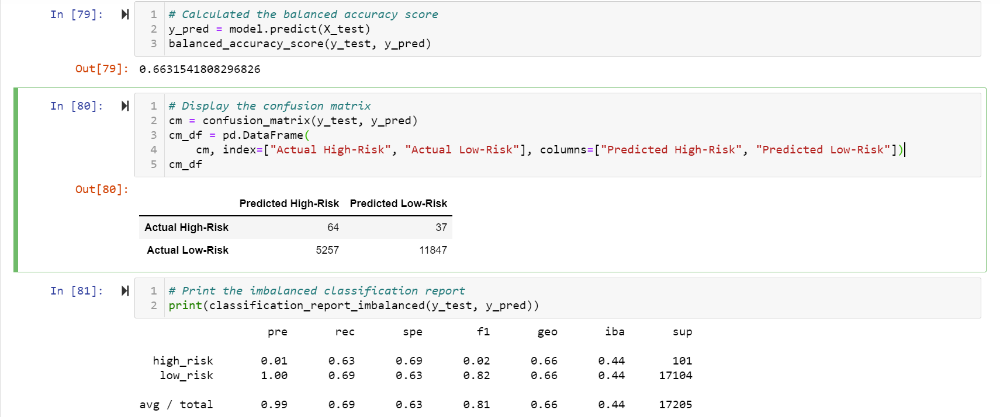
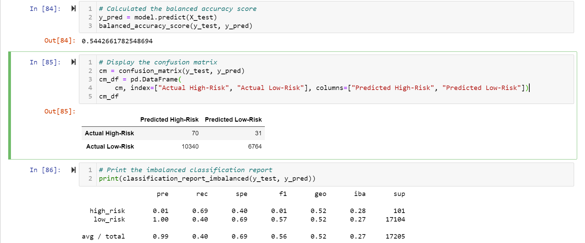
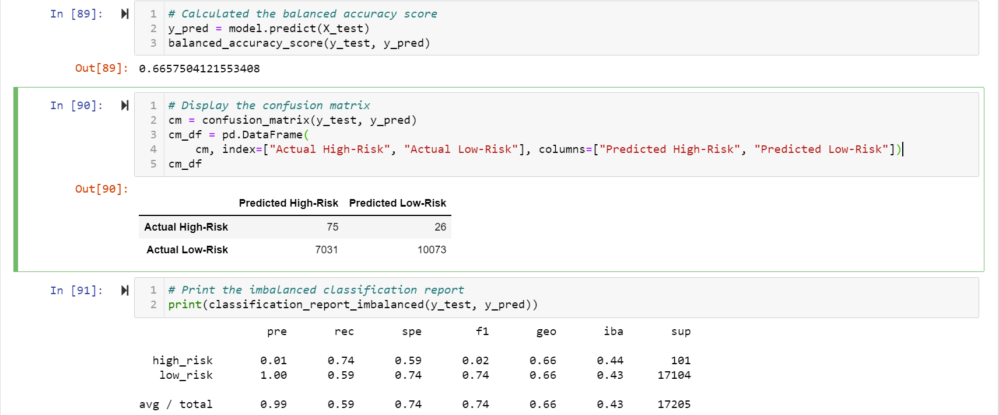
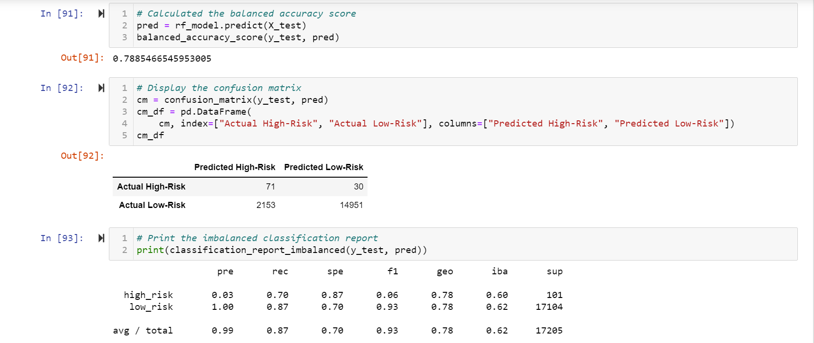
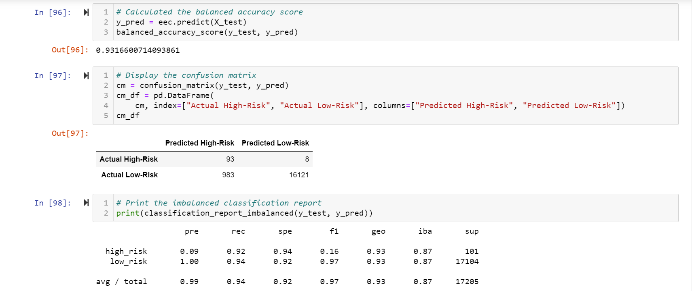

# Credit_Risk_Analysis
## Project Overview

## Resources
- Python 3.7.6
  - Pandas
  - Scikit-learn
- Jupyter Notebook

## Results

<h3 align="center"> Naive Random Oversampling </h3>

 

<h3 align="center"> SMOTE Oversampling </h3>

 

<h3 align="center"> Undersampling </h3>

 

<h3 align="center"> Combination Sampling </h3>

 

<h3 align="center"> Balanced Random Forest Classifier </h3>

 

<h3 align="center"> Easy Ensemble AdaBoost Classifier </h3>

 

## Summary

